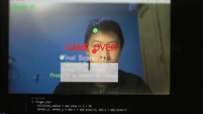

# 🍎 Voice-Controlled AI Fruit Hunter (基于计算机视觉的语音体感切水果)


> **A real-time interactive game combining Computer Vision, Hand Tracking, and Speech Recognition.**
> 一个融合了计算机视觉手势追踪与语音识别的多模态交互游戏。

## 📺 Demo Preview (演示)

**

## 🛠️ Key Features (核心功能)

* **Real-time Hand Tracking**: Powered by **MediaPipe**, achieving 30+ FPS low-latency interaction on standard CPUs.
  * *Index Finger*: Acts as a blade to cut fruits.
  * *Fist Gesture*: Triggers a "Knock" effect to push objects away.
* **Multimodal Interaction (Voice Control)**: Integrated **Baidu AipSpeech** with multithreading to handle voice commands asynchronously without blocking the render loop.
  * Command "Cut" (切): Instantly slices all screen objects.
  * Command "Slow" (慢): Triggers a "Bullet Time" effect (matrix style).
  * Command "Bomb" (炸): Detonates all bombs safely.
* **Physics Simulation**: Implemented parabolic motion physics with gravity acceleration and collision detection algorithms.
* **Dynamic Difficulty**: Adaptive spawn rates and "Bomb" mechanics to challenge player reflexes.

## 🚀 Tech Stack (技术栈)

* **Core Engine**: Python, OpenCV (cv2)
* **CV Pipeline**: MediaPipe Hands (Landmark Detection)
* **Audio Processing**: PyAudio + Baidu AipSpeech API
* **GUI**: Tkinter (for overlay voice feedback) + OpenCV HighGUI

## ⚙️ Installation (安装与运行)

1. **Clone the repository**
   ```bash
   git clone [https://github.com/YourUsername/AI-Fruit-Hunter.git](https://github.com/YourUsername/AI-Fruit-Hunter.git)
   cd AI-Fruit-Hunter
   ```
